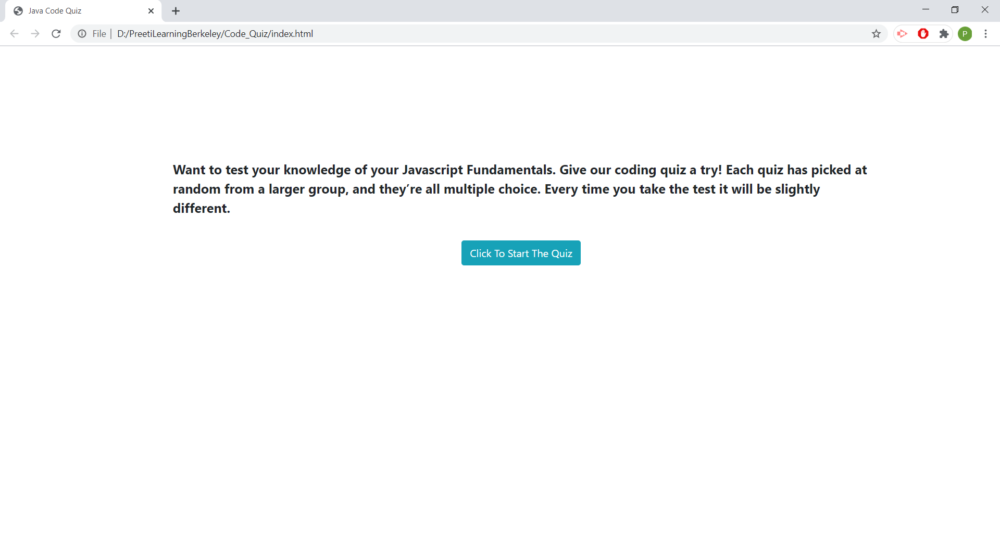
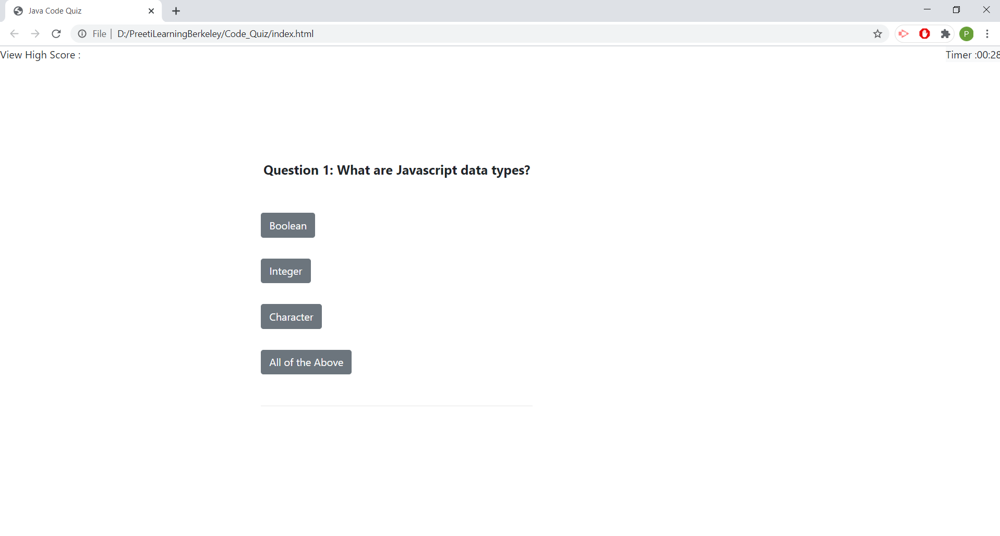
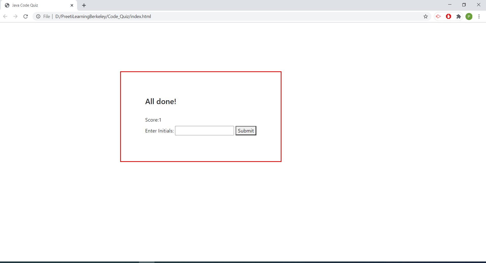
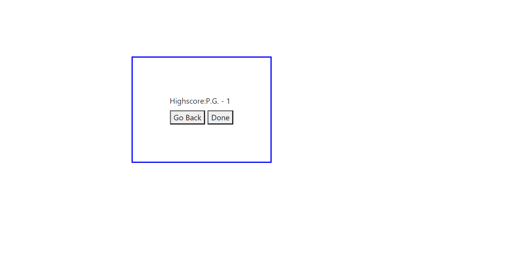

# Code_Quiz
# 04 Web APIs: Code Quiz

This is a quiz games of 10 questions. User are provided with multiple options and score is awarded for right answer. This is time bound game and users are provided 30 sec to answer each questions. If users fails to answer within 30 sec, it will be marked as wrong answer and next questions will appear on screen.
Maximum high score is 10. Once games is over users intial are displayed with the score.

## Requirement
1. *HTML*
2. *CSS*
3. *Javascript*
4. *Google Search*

## Installation Requirement
1. *VS Code*
2. Web Browser

My Code-Quiz Website Link ->  (https://preeti1234567.github.io/Code_Quiz/)

